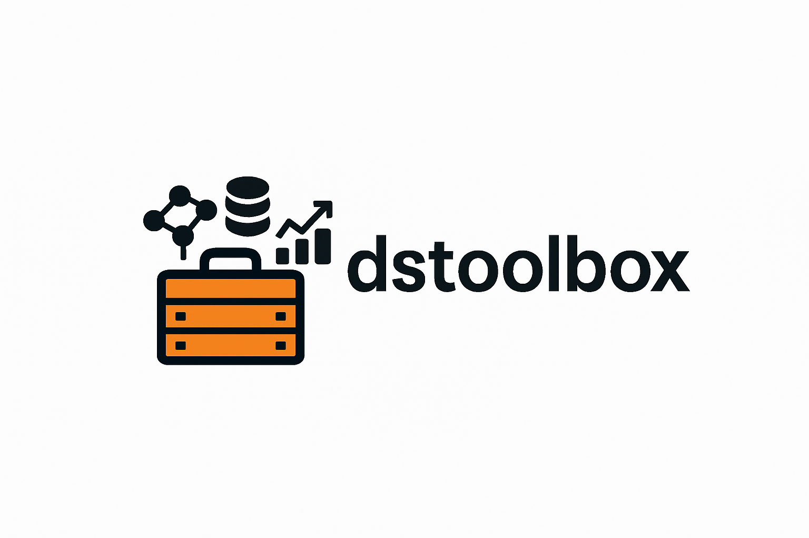
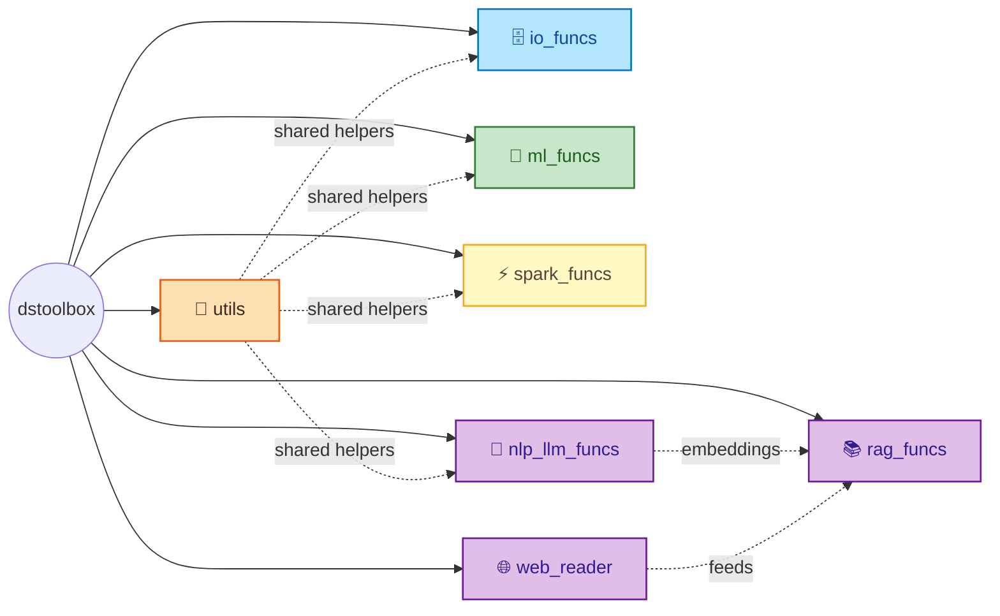

<p align="center">
  
</p>

<h1 align="center">dstoolbox</h1>

<p align="center">
  <em>A pragmatic grab-bag of Python utilities for day-to-day data-science and ML work.</em>
</p>

<p align="center">
  <a href="https://python.org"></a>
  <a href="https://www.gnu.org/licenses/gpl-3.0"></a>
  <a href="https://pandas.pydata.org/"></a>
  <a href="https://scikit-learn.org/"></a>
  <a href="https://pdoc.dev/"></a>
</p>

<p align="center">
  <a href="#whats-inside">What's inside</a> ·
  <a href="#architecture">Architecture</a> ·
  <a href="#install">Install</a> ·
  <a href="#quick-sanity-check--compare-two-column-lists">Quick start</a> ·
  <a href="#samples">Samples</a> ·
  <a href="#development">Development</a> ·
  <a href="#documentation">Docs</a>
</p>

---

`dstoolbox` bundles the things you would otherwise copy-paste into every notebook into one importable package — I/O against Azure / MSSQL / Synapse / Delta / PI Web API, model training / scoring, NLP + LLM tagging, RAG pipelines (crawl → convert → chunk → vector store), Spark ETL, statistical process control, and a long tail of pandas / plotting / stats helpers.

The intent is small: a new project starts with `import dstoolbox` and goes.

---

## What's inside

| Package                                       | Extra                            | What it covers                                                                                                                                                                                                                                                      |
| --------------------------------------------- | -------------------------------- | ------------------------------------------------------------------------------------------------------------------------------------------------------------------------------------------------------------------------------------------------------------------- |
| 🧰[`utils`](dstoolbox/utils)                 | *(base)*                       | Lists, text/regex, datetime, paths, logging, SQL parsing, encoding, dataframe ops, stats (incl. Statistical Process Control sigma / I-MR limits), plotly/matplotlib helpers (incl. I-MR and series-overlay charts).                                                 |
| 🗄️[`io_funcs`](dstoolbox/io_funcs)         | `[azure]` `[mssql]` `[pi]` | Azure (Synapse, Blob, ADLS, Key Vault), Databricks Delta, PI Web API, MSSQL, Postgres, named SQL templates, Colab/Kaggle bootstrap. All credentials flow through`data_sources.get(target_id)`.                                                                    |
| 🤖[`ml_funcs`](dstoolbox/ml_funcs)           | `[ml]` `[bayes]`               | Model templates, training (incl. nested CV), scoring, performance plots (ROC / PR / gain / lift / reliability / confusion), tuning, PCA/CCA, SHAP/PDP/feature importance, multilabel, regression assumption checks, time-series EDA / forecasters / backtest plots, and Bayesian two-sample estimation ([`stat_bayes`](dstoolbox/ml_funcs/stat_bayes.py): BEST + ROPE via PyMC — install `dstoolbox[bayes]`).
| ⚡[`spark_funcs`](dstoolbox/spark_funcs)     | `[spark]`                      | Asof joins, dataframe reshape utils, column finder, incremental ETL pipelines, rolling / tumbling time-series features.                                                                                                                                             |
| 📝[`nlp_llm_funcs`](dstoolbox/nlp_llm_funcs) | `[nlp]`                        | Text cleaning + anonymization, fuzzy / embedding similarity, LLM tagging chains.                                                                                                                                                                                    |
| 📚[`rag_funcs`](dstoolbox/rag_funcs)         | `[rag]`                        | RAG library helpers: docling-based document conversion, chunking, vector store.                                                                                                                                                                                     |
| 🌐[`web_reader`](dstoolbox/web_reader)       | `[webreader]`                  | Integrated CLI subpackage: URL → Markdown pipeline (`scraper`, `harvest`, `convert`, `run_pipeline`). Exposes the `webreader-scrape` / `-harvest` / `-convert` / `-pipeline` console scripts.                                                      |

---

## Architecture

Seven subpackages hang off one importable root. The top-level `dstoolbox`
does lazy `try` / `except` imports so a missing extra (spark, hyperopt,
docling, ...) never breaks `import dstoolbox`.



See [docs/README.md#credential-seam](docs/README.md#credential-seam) for the
credential-flow sequence diagram (how `data_sources.get` funnels every I/O
path through Azure Key Vault or an env-var override, with a dict-backed
fake for tests).

---

## Install

Python 3.9+ is required. `dstoolbox` installs entirely via `pip` — **no conda step is needed and none is used**. Every runtime dependency (base and extras) is open-source and freely redistributable (BSD / MIT / Apache 2.0 / PSF / ISC); no proprietary SDKs are pulled in.

### 1. Create and activate a virtual environment

Pick one of the standard options:

```bash
# Option A — stdlib venv (recommended, no extra tools required)
python3 -m venv .venv
source .venv/bin/activate            # macOS / Linux
# .venv\Scripts\activate             # Windows PowerShell

# Option B — uv (fast, drop-in replacement for venv+pip)
uv venv .venv && source .venv/bin/activate

# Option C — virtualenv
python3 -m pip install --user virtualenv
python3 -m virtualenv .venv && source .venv/bin/activate
```

Upgrade the packaging toolchain once the env is active:

```bash
python -m pip install --upgrade pip setuptools wheel
```

### 2. Install the package + the extras you need

```bash
# Clone the dstoolbox repository (replace with your fork / mirror URL):
git clone <dstoolbox-repo-url>
cd dstoolbox

# Base install (numpy / pandas / scipy / scikit-learn / matplotlib / seaborn /
# plotly / pyyaml / tqdm / requests / ipython)
pip install -e .

# Pick the extras you actually need
pip install -e ".[azure,mssql,ml]"
pip install -e ".[rag]"
pip install -e ".[webreader,nlp,pi]"

# Everything except dev/test
pip install -e ".[all]"

# Contributor setup (adds pre-commit, ruff, black, mypy, pytest)
pip install -e ".[dev,test]"
```

If you'd rather pin a fully-reproducible environment, freeze after install:

```bash
pip freeze > requirements.lock.txt
```

### 3. Register the env as a Jupyter kernel (optional)

```bash
pip install ipykernel
python -m ipykernel install --user --name dstoolbox --display-name "dstoolbox"
```

### Available extras

| Extra                 | Adds                                                                                                                                                              |
| --------------------- | ----------------------------------------------------------------------------------------------------------------------------------------------------------------- |
| `azure`             | `azure-storage-blob`, `azure-identity`, `azure-keyvault-secrets`, `azure-core`                                                                            |
| `mssql`             | `pyodbc`, `sqlalchemy`                                                                                                                                        |
| `spark`             | `pyspark`                                                                                                                                                       |
| `rag`               | `docling`, `langchain-chroma`, `langchain-community`, `langchain-core`, `langchain-huggingface`, `langchain-milvus`, `beautifulsoup4`, `requests` |
| `webreader`         | `beautifulsoup4`, `requests`, `python-dotenv`, `markdownify`, `pypdf`, `requests-ntlm`, `tqdm`, `docling`                                         |
| `webreader-stealth` | everything in`[webreader]` plus `scrapling`, `curl_cffi`, `patchright`, `msgspec`, `camoufox` (only needed for `--fetcher stealthy`)                |
| `nlp`               | `spacy`, `sentence-transformers`                                                                                                                              |
| `pi`                | `requests`, `requests-ntlm`                                                                                                                                   |
| `ml`                | `xgboost`, `lightgbm`, `optuna`, `shap`, `hyperopt`, `researchpy`, `statsmodels`                                                                    |
| `dev`               | `pre-commit`, `ruff`, `black`, `mypy`                                                                                                                     |
| `test`              | `pytest`, `pytest-cov`, `pytest-mock`                                                                                                                       |
| `all`               | everything except`dev` / `test`                                                                                                                               |

> Native extensions (`pyodbc`, `xgboost`, `lightgbm`, some `azure-*` wheels, `pyspark`'s JVM) rely on system libraries. On macOS you may need `brew install unixodbc libomp openjdk`; on Debian/Ubuntu: `apt-get install unixodbc-dev libomp-dev default-jre`.

---

## Quick sanity check — compare two column lists

[`compare_lists`](dstoolbox/utils/text.py) runs a fuzzy diff between two lists (schema drift, feature-set changes, migration audits, glossary alignment):

```python
from dstoolbox.utils import compare_lists

old_cols = ["customer_id", "OrderDate", "total_amount", "email address"]
new_cols = ["customer_id", "order_date", "total_amount_usd", "phone_number"]

result_df, summary, _fig = compare_lists(
    old_cols, new_cols,
    similarity_threshold=60,
    listA_name="v1", listB_name="v2",
)
print(result_df.to_string(index=False))
```

Expected output:

```text
 Index       Element Group            Match Similarity
     1     OrderDate  Both       order_date     100.0%
     2   customer_id  Both      customer_id     100.0%
     3  total_amount  Both total_amount_usd      88.0%
     4 email address    v1
     5  phone_number    v2
```

`summary` is a printable multi-section report (fuzzy match details + group counts). Pass `create_venn=True` to also return a matplotlib Venn diagram.

---

## Package layout

```text
dstoolbox/
├── utils/           lists · text · datetime_utils · paths · logging_utils ·
│                    sql · encoding · dataframes/ · stats · plots
├── io_funcs/        bootstrap · data_sources · db · synapse · delta ·
│                    templates · blob · pi · mssql · colab · exceptions
├── ml_funcs/        scores · templates · training · performance_plots ·
│                    feature_importance · tuning · pca · assumptions/ ·
│                    helpers · multilabel · backtest_plots/ · forecasters/
├── spark_funcs/     joins · reshape · columns · col_finder · pipelines · features
├── nlp_llm_funcs/   text_utils · similarity · llm_tagging
├── rag_funcs/       setup_helpers · custom_converter · chunking · vectorstore
├── web_reader/      Integrated CLI subpackage: scraper.py + harvest.py + convert.py + run_pipeline.py (+ tools/)
├── config.yml       Default platform config
└── sql_template.yml Named SQL queries
```

Each package's `__init__.py` re-exports its public names — both `from dstoolbox.io_funcs import blob2pd` and `from dstoolbox.io_funcs.blob import blob2pd` work.

---

## Samples

See [dstoolbox/README.md](dstoolbox/README.md) for detailed usage of `io_funcs`, `ml_funcs`, and `rag_funcs`.

Two callouts:

### Query Synapse via the DataSource seam

```python
from dstoolbox import io_funcs

df = io_funcs.query_synapse_db(
    query="SELECT TOP 10 * FROM analytics.vw_orders",
    target_id="azure_synapse",   # key under `data_sources:` in config.yml
    verbose=True,
)
```

### Compare models on a time-series split

[`ml_comparison`](dstoolbox/ml_funcs/training.py) runs several estimators through the same CV splitter and returns a per-fold + aggregate score table. Feed it a `TimeSeriesSplit` and it becomes a walk-forward evaluator; no extras are needed for regression on the base install:

```python
import numpy as np
import pandas as pd
from sklearn.model_selection import TimeSeriesSplit
from sklearn.linear_model import Ridge
from sklearn.ensemble import GradientBoostingRegressor
from dstoolbox.ml_funcs.training import ml_comparison

rng = np.random.default_rng(0)
n = 200
t = np.arange(n)
X = pd.DataFrame({"lag1": rng.normal(size=n), "trend": t / n})
y = pd.Series(0.5 * X["lag1"] + 2.0 * X["trend"] + rng.normal(scale=0.3, size=n))

tscv = TimeSeriesSplit(n_splits=5)
models = [Ridge(alpha=1.0, random_state=0),
          GradientBoostingRegressor(random_state=0)]

metrics = ml_comparison(
    ml_models=models, X=X, y=y,
    scores_names=["R2", "mean_absolute_error", "mean_squared_error"],
    sk_fold=tscv,
    map_names={0: "Ridge", 1: "GBR"},
    plot=False, verbose=False, show_capabilities=False,
)
print(metrics[metrics["CV"] == "CV_scores_Mean"].to_string(index=False))
```

Expected output (rounded):

```text
model             CV        R2 mean_absolute_error mean_squared_error
Ridge CV_scores_Mean  0.534978            0.303646           0.145993
  GBR CV_scores_Mean  0.374834            0.330461           0.194721
```

The full `metrics` frame has one row per (model, fold) plus per-model `CV_scores_Mean` / `CV_scores_STD` / `scores_all` rows and an `elapsed_time` column. Pass `plot=True` to render a bar chart via [`ml_comparison_plot`](dstoolbox/ml_funcs/performance_plots.py). Classification metrics use names like `accuracy`, `f1`, `roc_auc`, `mcc`, `kappa` — the full name list lives in [`scores.metric_dict`](dstoolbox/ml_funcs/scores.py).

### Explore more

A few of the most useful helpers that don't get a full sample above — all importable directly from `dstoolbox.utils` (or their submodule):

- [`compare_dataframes_columns`](dstoolbox/utils/dataframes.py) — side-by-side diff of two frames' columns (dtypes, null counts, sample values). Returns `(summary_df, missing_in_A, missing_in_B)`; pass `display=True` for a Jupyter-styled preview. The class-based [`DataFrameColumnComparator`](dstoolbox/utils/dataframes.py) is the reusable engine underneath.
- [`reduce_mem_usage`](dstoolbox/utils/dataframes.py) — downcast numeric columns and convert low-cardinality strings to `category` in one pass.
- [`null_per_column`](dstoolbox/utils/dataframes.py) — quick null-density report per column, sorted.
- [`flexible_join`](dstoolbox/utils/dataframes.py) — pandas merge that tolerates dtype / case / whitespace differences on the join keys.
- [`stack_plotly_subplots`](dstoolbox/utils/plots.py) — stack a list of Plotly Express figures into a single 3-row subplot with a shared title.
- [`figures_to_html`](dstoolbox/utils/plots.py) / [`save_plotly_fig`](dstoolbox/utils/plots.py) — write one or many Plotly figures to an HTML dashboard or `<prefix>.{html,json,png}` bundle.
- [`analyze_categorical_data`](dstoolbox/utils/stats.py) / [`hypothesis_test`](dstoolbox/utils/stats.py) — one-shot categorical / numeric hypothesis testing with interpreted output.
- [`prepare_consecutive_events`](dstoolbox/spark_funcs/events.py) / [`merge_events`](dstoolbox/spark_funcs/events.py) / [`analyze_temporal_overlaps`](dstoolbox/spark_funcs/events.py) — Spark helpers for consecutive- and overlapping-event analysis.
- [`group_by_proximity`](dstoolbox/spark_funcs/spatial.py) — cluster rows whose caller-supplied distance falls below a threshold.

Run `python -c "import dstoolbox.utils as u; print([n for n in dir(u) if not n.startswith('_')])"` for the full re-exported surface.

---

## Development

```bash
pip install -e ".[dev,test]"
pre-commit install
pre-commit run --all-files
pytest -q --cov=dstoolbox
mypy
```

CI runs the same three stages: `lint`, `typecheck`, `test`.

---

## Documentation

API reference is generated with [pdoc](https://pdoc.dev/) directly from the
docstrings — no config file needed.

```bash
pip install -e ".[docs]"
bash scripts/build_docs.sh            # writes docs/api/index.html
bash scripts/build_docs.sh --serve    # live-reload dev server on :8080
```

See [`docs/`](docs/) for ADRs and Databricks examples.
On `main`, the `pages` CI job publishes `docs/api/` to GitLab Pages.

---

## License

GPL-3.0-or-later. See [LICENSE](LICENSE).
