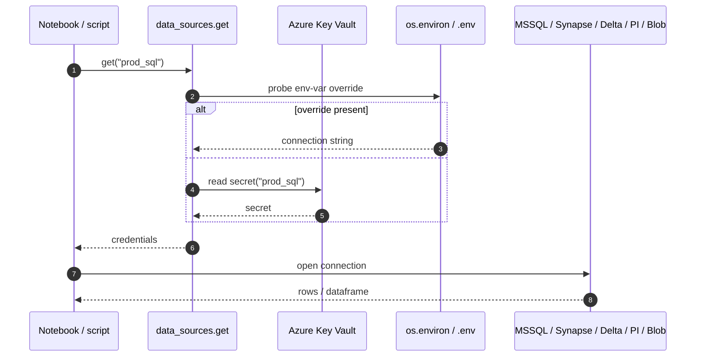

# dstoolbox — Documentation

What lives where:

| Path | Contents |
|---|---|
| [`api/`](api/) | Auto-generated HTML API reference (produced by [`pdoc`](https://pdoc.dev/)). **Not checked in.** Build it locally or in CI. |
| [`assets/`](assets/) | Static assets (logo, favicon) used by the generated site. |
| [`adr/`](adr/) | Architecture Decision Records. Numbered, immutable once accepted. |
| [`examples/`](examples/) | Runnable / read-only scripts illustrating end-to-end usage. |

## Build the API reference locally

```bash
pip install -e ".[docs]"
bash scripts/build_docs.sh          # one-shot → docs/api/index.html
bash scripts/build_docs.sh --serve  # live-reload dev server on :8080
```

The build script passes pdoc these flags:

- `--logo` / `--favicon`: dstoolbox logo in the sidebar and browser tab.
- `--footer-text`: project + license line on every page.
- `--math`: MathJax renders LaTeX in docstrings (e.g. `$\sigma$`).
- `--mermaid`: Mermaid diagrams inside ` ```mermaid ` fenced blocks render
  as SVG (see `dstoolbox/__init__.py` for an example).
- `--search`: client-side full-text search over the generated site.
- `--docformat numpy`: numpy-style docstring sections (`Parameters`,
  `Returns`, `Examples`, ...).

Override branding without editing the script:

```bash
DSTOOLBOX_DOCS_LOGO_URL="https://.../my-logo.png" \
DSTOOLBOX_DOCS_FOOTER="dstoolbox 0.4.0 · internal build" \
    bash scripts/build_docs.sh
```

## Adding a new ADR

1. Copy the numbering pattern (`NNNN-short-slug.md`).
2. Sections: **Status**, **Decision**, **Why**, **Consequences**.
3. Never edit an accepted ADR. Supersede it with a new one.

## Credential seam

Every credential flows through one function. Notebook code never sees a
raw connection string; tests swap in a dict-backed fake:



