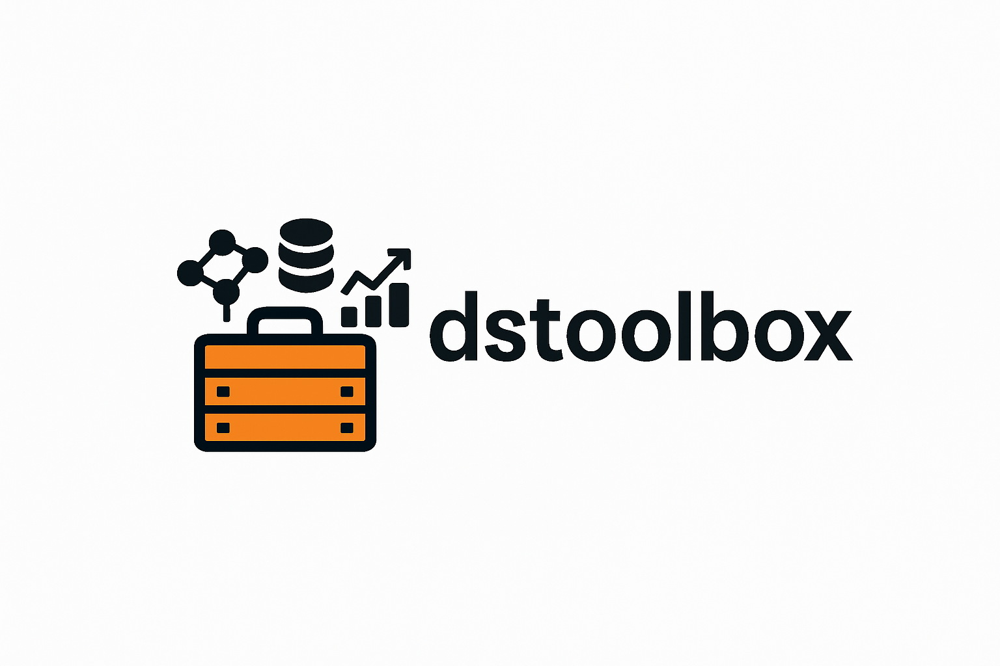

# 🧰 Data Science Toolbox

[](https://python.org)
[](https://opensource.org/licenses/MIT)
[](https://pandas.pydata.org/)
[](https://scikit-learn.org/)
[](https://azure.microsoft.com/)
[](https://spark.apache.org/)

<div align="center">
  
</div>

**Comprehensive Python Toolkit for Data Science & ML Workflows**

</div>

```
    ┌─────────────────────────────────────────────────────────────┐
    │                🧰 DATA SCIENCE TOOLBOX 🧰                  │
    ├─────────────────────────────────────────────────────────────┤
    │  📁 I/O Operations       │  🧠 NLP/LLM Processing            │
    │  ├─ Azure Integration    │  ├─ Text Preprocessing            │
    │  ├─ MSSQL Databases      │  ├─ Similarity Analysis           │
    │  ├─ Colab/Kaggle         │  └─ LangChain Integration         │
    │  └─ Multi-Platform       │                                   │
    │                          │  ⚙️  ML Utilities                 │
    │  🔥 Spark Operations     │  ├─ Feature Engineering           │
    │  ├─ Big Data Processing  │  ├─ Model Evaluation              │
    │  ├─ Distributed Compute  │  └─ Statistical Analysis          │
    │  └─ ETL Workflows        │                                   │
    │                          │  🔍 RAG Systems                   │
    │  💻 CLI Tools            │  ├─ Vector Databases              │
    │  ├─ Automation           │  ├─ Knowledge Retrieval           │
    │  ├─ Workflows            │  └─ Embedding Management          │
    │  └─ Utilities            │                                   │
    └─────────────────────────────────────────────────────────────┘
```

A comprehensive Python toolkit providing specialized functions for data science and machine learning workflows across multiple domains including I/O operations, NLP/LLM processing, machine learning utilities, and more.

## 🚀 Quick Start Tutorial

### 1. Installation & Setup
```bash
# Clone the repository
git clone https://github.com/mrrnour/ds_toolbox_public.git
cd ds_toolbox_public/dsToolbox

# Create conda environment
conda create --name ds_toolbox python=3.9 -y
conda activate ds_toolbox

# Install dependencies
pip install -r requirements.txt
```

### 2. Your First Data Science Workflow
```python
# Import the toolbox modules
from io_funcs import MSSQLManager, ConfigurationManager
from ml_funcs import train_test_split, evaluate_model
from nlp_llm_funcs import TextSimilarityAnalyzer
from common_funcs import data_profiling

# Example: Complete data pipeline
def example_workflow():
    # 1. Data Loading (I/O Operations)
    config_mgr = ConfigurationManager('config.yml')
    sql_mgr = MSSQLManager(config_mgr)
    df = sql_mgr.read_sql("SELECT * FROM customer_data", 'prod_server')
    
    # 2. Data Analysis (Common Functions)
    profile = data_profiling(df)
    print(f"Dataset shape: {profile['shape']}")
    
    # 3. Text Processing (NLP Functions)
    if 'text_column' in df.columns:
        similarity = TextSimilarityAnalyzer()
        df_clean = similarity.merge_similar_text_entries(df, 'text_column')
    
    # 4. Machine Learning (ML Functions)
    X_train, X_test, y_train, y_test = train_test_split(df, target='target')
    model_results = evaluate_model(model, X_test, y_test)
    
    return model_results

# Run the workflow
results = example_workflow()
```

### 3. Module-Specific Examples

#### 📁 I/O Operations
```python
# Multi-platform database connections
from io_funcs import MSSQLManager, AzureManager

# MSSQL Operations
mssql = MSSQLManager()
engine = mssql.get_engine('production_db')
df = pd.read_sql("SELECT * FROM sales_data WHERE date >= '2024-01-01'", engine)

# Azure Blob Storage
azure = AzureManager()
blob_spec = {'storage_account': 'myaccount', 'container': 'data', 'blob': 'dataset.csv'}
azure.write_pandas_to_blob(df, blob_spec)
```

#### 🧠 NLP & LLM Processing
```python
# Text similarity and processing
from nlp_llm_funcs import TextSimilarityAnalyzer, TextPreprocessor

# Clean and analyze text data
preprocessor = TextPreprocessor()
df_clean = preprocessor.expand_acronyms_with_descriptions(df, acronym_df)
df_anonymous = preprocessor.anonymize_personal_information(df['text_column'])

# Similarity analysis
analyzer = TextSimilarityAnalyzer()
similarity_score = analyzer.calculate_pairwise_similarity("text1", "text2", method="sentence_transformer")
```

#### ⚙️ Machine Learning Utilities
```python
# Model Templates and Training
from ml_funcs import ModelTemplateManager, ModelTrainer, ModelEvaluator

# Get pre-configured ML models
template_manager = ModelTemplateManager(random_state=42)
models = template_manager.get_classification_models(X_train, y_train)

# Compare multiple models
trainer = ModelTrainer()
results = trainer.compare_models(models, X_train, y_train, cv_folds=5)

# Advanced Analytics
from ml_funcs import MulticollinearityDetector, CanonicalAnalyzer, ClusteringAnalyzer

# Detect multicollinearity issues
detector = MulticollinearityDetector(vif_threshold=5.0)
vif_results, problematic_features, recommendations = detector.analyze_multicollinearity_patterns(X)

# Canonical Correlation Analysis
cca_analyzer = CanonicalAnalyzer()
cca_results = cca_analyzer.perform_canonical_correlation_analysis(X1, X2, n_canonical_components=3)

# Optimal clustering analysis
cluster_analyzer = ClusteringAnalyzer()
clustering_results = cluster_analyzer.perform_optimal_clustering_analysis(data, cluster_range=range(2, 8))

# Enhanced PCA Analysis
pca_reducer = DimensionalityReducer(random_state=42)

# Create comprehensive variance visualizations with elbow detection
var_ratios, eigenvals = pca_reducer.create_explained_variance_visualization(
    fitted_pca_model, output_folder='./plots/', plot_type='both'
)

# Apply varimax rotation for better interpretability  
rotation_matrix = pca_reducer.apply_varimax_rotation(pca_loadings, 'varimax')
rotated_loadings = pca_loadings @ rotation_matrix

# Calculate feature importance based on PCA components
feature_importance = pca_reducer.calculate_feature_importance_scores(
    pca_transformed_data, pca.components_, feature_names
)

# Create publication-quality biplot
ax = pca_reducer.create_biplot_visualization(
    pca_data, pca.components_, feature_names, sample_labels=groups
)

# Multi-Label Classification Analysis
ml_classifier = MultiLabelClassifier(random_state=42)

# Stratified splitting preserving label distribution
samples_split, labels_split = ml_classifier.split_dataset_with_stratification(
    df_samples, df_binary_labels, train_size=0.7, validation_size=0.15, test_size=0.15
)

# Comprehensive multi-label evaluation
performance_metrics, eval_df = ml_classifier.evaluate_multilabel_performance(
    y_pred, y_true, averaging_strategy='macro'
)
print(f"Subset accuracy: {performance_metrics['subset_accuracy']:.3f}")
```

#### 🔍 Advanced Data Utilities
```python
# Enhanced Class-Based Utilities
from utilities import (TextProcessor, DataVisualization, PartitionAnalyzer, 
                      EncodingUtilities, SQLProcessor)
from ml_funcs import DimensionalityReducer

# Text Processing and Normalization
processor = TextProcessor()
clean_text = processor.normalize_text("Special@#$Characters", replace_with='_')
clean_cols = processor.clean_column_names(['First Name', 'Email@Address'])
matches = processor.find_fuzzy_matches(['Apple Inc.'], ['apple incorporated'])

# Advanced Data Visualization
viz = DataVisualization()
# Interactive Sankey flow diagrams
flow_data = viz.create_sankey_flow_diagram(sources, targets, values, 
                                          minimum_flow_threshold=100)
# 3D scatter plots with clustering results
viz.create_3d_scatter_plot(pca_data, cluster_labels, 
                          ['PC1', 'PC2', 'PC3'], 'PCA Clustering')
# Word cloud generation from text data
viz.generate_word_cloud_visualization(text_series, max_words=200)

# Dimensionality Reduction (Enhanced ML Functionality)
reducer = DimensionalityReducer()
fig, coords = reducer.create_tsne_visualization(data, class_labels=labels, n_dimensions=2)
```

#### 🆕 New Comparative Analysis & Statistical Utilities
```python
# Advanced Comparative Visualization
from utilities import ComparativeVisualization, StatisticalUtilities

# Create publication-quality Venn diagrams with fuzzy matching
visualizer = ComparativeVisualization()
company_names = ['Apple Inc.', 'Microsoft Corp', 'Google LLC']  
cleaned_names = ['apple incorporated', 'microsoft corporation', 'amazon.com']

# Generate comprehensive comparison with visualization
fig = visualizer.create_fuzzy_matching_venn_diagram(
    company_names, cleaned_names, 
    similarity_threshold=70,
    list_a_name='Original Names',
    list_b_name='Cleaned Names',
    output_path='comparison.png'
)

# Detailed list comparison with statistical analysis
comparison_results = visualizer.create_comprehensive_list_comparison(
    company_names, cleaned_names,
    similarity_threshold=60,
    include_venn_diagram=True
)

# Professional Statistical Analysis
stats = StatisticalUtilities()

# Advanced feature selection with multiple methods
feature_results = stats.perform_advanced_feature_selection(
    X_train, y_train, 
    selection_methods=['chi2', 'f_classif', 'mutual_info'],
    feature_count=10
)

# Comprehensive hypothesis testing suite
hypothesis_results = stats.conduct_hypothesis_testing(
    sample_data, 
    test_types=['normality', 'independence', 't_test'],
    significance_level=0.05
)
```

#### 🔍 Advanced Data Utilities (Continued)
```python

# Advanced Partition Analysis
analyzer = PartitionAnalyzer()
partitions = analyzer.generate_all_set_partitions(['A', 'B', 'C'], 
                                                 min_subset_count=2)
mapping = analyzer.create_element_grouping_map(partitions[0])

# Optimized Data Encoding
encoder = EncodingUtilities()
dummy_df = encoder.create_optimized_dummy_encoding(category_series)
sparse_df = encoder.create_sparse_label_encoding(df, 'categories', 'values')
```

#### 🔥 Spark Operations
```python
# Big data processing with Spark
from spark_funcs import SparkManager

spark_mgr = SparkManager()
large_df = spark_mgr.read_parquet('hdfs://data/large_dataset.parquet')
processed_df = spark_mgr.apply_transformations(large_df, transformations)
```

## Available Modules

### Core I/O Operations (`io_funcs.py`)
Unified I/O operations across Azure cloud services, MSSQL databases, Google Colab environments, and Kaggle datasets with automatic platform detection and connection-first approach.

### NLP & LLM Processing (`nlp_llm_funcs.py`)
Advanced natural language processing functions including text preprocessing, similarity analysis, anonymization, and LangChain integration for LLM workflows.

### Machine Learning Utilities (`ml_funcs.py`)
Comprehensive machine learning functions including:
- **Model Templates & Training**: Pre-configured ML models with pipelines
- **Advanced Analytics**: Multicollinearity detection, Canonical Correlation Analysis, K-means clustering
- **Model Evaluation**: Cross-validation, performance metrics, SHAP analysis
- **Feature Engineering**: Data preprocessing, statistical analysis, rule extraction

#### 🆕 Enhanced Classes:

- **DimensionalityReducer**: Enhanced PCA analysis and visualization toolkit
  - `create_explained_variance_visualization()`: Publication-quality scree and cumulative variance plots
  - `apply_varimax_rotation()`: Orthogonal rotation for improved component interpretability
  - `calculate_feature_importance_scores()`: Feature contribution analysis for PCA components
  - `create_biplot_visualization()`: Comprehensive biplot creation with sample and feature vectors

- **MultiLabelClassifier**: Specialized multi-label classification utilities
  - `split_dataset_with_stratification()`: Stratified splitting maintaining label distribution
  - `evaluate_multilabel_performance()`: Comprehensive multi-label evaluation with macro/micro/weighted averages
  - Subset accuracy calculation and detailed per-label metrics

### Spark Operations (`spark_funcs.py`)
Specialized functions for Apache Spark data processing, distributed computing, and big data operations.

### RAG Systems (`rag_funcs.py`)
Retrieval-Augmented Generation functions for building and managing RAG pipelines, vector databases, and knowledge retrieval systems.

### Command Line Tools (`cl_funcs.py`)
Command-line interface utilities and automation functions for streamlined data science workflows.

### Common Utilities (`utilities.py`)
Enhanced utility functions with comprehensive class-based organization:
- **Text Processing**: Advanced text normalization, filename sanitization, fuzzy matching
- **Data Visualization**: Interactive Sankey diagrams, 3D scatter plots, word clouds
- **Partition Analysis**: Combinatorial set partitions, element grouping, mathematical analysis
- **DataFrame Operations**: Column reordering, memory optimization, missing value analysis
- **File System**: Path validation, ZIP extraction, directory management
- **SQL Processing**: Query parsing, statement splitting, file processing
- **Advanced Encoding**: Optimized dummy encoding, sparse label processing

#### 🆕 New Enhanced Classes:

- **ComparativeVisualization**: Advanced visualization utilities for comparative data analysis
  - `create_fuzzy_matching_venn_diagram()`: Publication-quality Venn diagrams with fuzzy string matching
  - `create_comprehensive_list_comparison()`: Detailed list comparison with statistical analysis
  - Interactive visualizations with matplotlib and comprehensive reporting

- **StatisticalUtilities**: Professional statistical analysis and feature engineering tools  
  - `perform_advanced_feature_selection()`: Multi-method feature selection with statistical validation
  - `conduct_hypothesis_testing()`: Comprehensive hypothesis testing suite
  - `analyze_distribution_properties()`: Distribution analysis with normality testing
  - Statistical significance testing and effect size calculations

### Backward Compatibility (`common_funcs.py`)
Deprecated function module providing seamless migration support:
- **Automatic Migration**: Old functions automatically redirect to new class-based implementations
- **Deprecation Warnings**: Clear guidance on updating to the new API
- **Full Functionality**: All original functionality preserved while encouraging modern usage
- **Migration Guide**: Comprehensive examples showing old vs new syntax patterns

## I/O Functions - Detailed Documentation

## Features

- **Environment-Aware**: Automatically detects and adapts to different platforms (Colab, Databricks, Local, VM/Docker)
- **Connection-First Pattern**: Create connections/engines once, reuse multiple times for better performance
- **Unified Configuration**: Single YAML configuration file for all services
- **Cross-Platform**: Works across different environments with appropriate adaptations

## Quick Start

```python
from io_funcs_unified import (
    AzureManager, 
    MSSQLManager, 
    ColabManager, 
    KaggleManager,
    detect_platform
)

# Check your current platform
print(f"Running on: {detect_platform()}")
```

## Core Manager Classes

### ConfigurationManager

First, you need to create a configuration manager that loads your YAML config file:

```python
from io_funcs_unified import ConfigurationManager

# Load configuration from YAML file
config_manager = ConfigurationManager('config.yml')

# Or load it later
config_manager = ConfigurationManager()
config_manager.load_configuration('config.yml')

# Access config data directly if needed
print(config_manager.config)  # Shows all loaded configuration
```

### 1. MSSQLManager

Dedicated MSSQL database operations with connection pooling.

```python
# Method 1: Initialize with existing config manager
config_manager = ConfigurationManager('config.yml')
mssql_mgr = MSSQLManager(config_manager)

# Method 2: Let MSSQLManager create its own config manager
mssql_mgr = MSSQLManager()  # Will create internal ConfigurationManager

# Get SQLAlchemy engine (recommended for pandas)
engine = mssql_mgr.get_engine('server1')
df = pd.read_sql("SELECT * FROM users", engine)

# Or get PyODBC connection for direct use
conn, config = mssql_mgr.get_connection('server1', 'pyodbc')

# Write data to database
mssql_mgr.write_dataframe_to_mssql(df, 'output_table', 'server1')

# Check if table exists
exists = mssql_mgr.check_table_exists('schema.table_name', 'server1')

# Get latest date from a table
latest_date = mssql_mgr.get_latest_date_from_table('logs', 'server1', 'timestamp')
```

### 2. AzureManager

Unified Azure operations for Synapse, Blob Storage, and Delta Tables.

```python
# Method 1: Initialize with existing config manager
config_manager = ConfigurationManager('config.yml')
azure_mgr = AzureManager(config_manager)

# Method 2: Let AzureManager create its own config manager
azure_mgr = AzureManager()  # Will create internal ConfigurationManager

# Synapse Operations (for Spark/Databricks)
url, properties = azure_mgr.get_synapse_engine('azure_synapse')
df = spark.read.jdbc(table="(SELECT * FROM table) query", url=url, properties=properties)

# Execute Delta Table queries
result = azure_mgr.execute_delta_table_query("SELECT * FROM delta_table")

# Blob Storage Operations
blob_spec = {
    'storage_account': 'mystorageaccount',
    'container': 'data',
    'blob': 'dataset.csv'
}

# Read blob to Spark DataFrame
spark_df = azure_mgr.read_blob_to_spark(blob_spec)

# Write Pandas DataFrame to blob
azure_mgr.write_pandas_to_blob(pandas_df, blob_spec)

# Check if blob exists
exists = azure_mgr.check_blob_exists(blob_spec)
```

### 3. ColabManager

Google Colab environment setup and management.

```python
# Method 1: Initialize with existing config manager (if you have config needs)
config_manager = ConfigurationManager('config.yml')
colab_mgr = ColabManager(config_manager)

# Method 2: Simple initialization (most common for Colab)
colab_mgr = ColabManager()  # Only works in Google Colab environment

# Complete environment setup
results = colab_mgr.setup_environment(
    user_email="your-email@domain.com",
    user_name="Your Name",
    ssh_source_path="/content/drive/MyDrive/.ssh"
)

# Individual operations
drive_mounted = colab_mgr.mount_google_drive()
github_setup = colab_mgr.setup_github_integration(
    "your-email@domain.com", 
    "Your Name", 
    "/content/drive/MyDrive/.ssh"
)
```

### 4. KaggleManager

Cross-platform Kaggle dataset operations.

```python
kaggle_mgr = KaggleManager()

# Setup Kaggle credentials (works on any platform)
success = kaggle_mgr.setup_credentials('/path/to/kaggle.json')

# Download competition dataset
success = kaggle_mgr.download_competition_dataset(
    competition_name='titanic',
    download_directory='/data/titanic',
    extract_folders=('train.csv', 'test.csv'),  # Optional: only extract specific files
    exclude_folders=('sample_submission.csv',),  # Optional: exclude specific files
    clean_up_zip=True
)
```

## Complete Example: Using Everything Together

Here's a complete example showing how to use config_manager with different managers:

```python
import pandas as pd
from io_funcs_unified import ConfigurationManager, MSSQLManager, AzureManager

# Step 1: Create configuration manager
config_manager = ConfigurationManager('config.yml')

# Step 2: Create managers using the same config
mssql_mgr = MSSQLManager(config_manager)
azure_mgr = AzureManager(config_manager)

# Step 3: Use MSSQL operations
engine = mssql_mgr.get_engine('dev')  # 'dev' is server_id from config.yml
df_from_sql = pd.read_sql("SELECT * FROM users WHERE active=1", engine)

# Step 4: Use Azure operations 
blob_spec = {
    'storage_account': 'mystorageaccount',
    'container': 'data', 
    'blob': 'processed_data.csv'
}
azure_mgr.write_pandas_to_blob(df_from_sql, blob_spec)

# Step 5: Read it back from Azure
df_from_blob = azure_mgr.read_blob_to_pandas(blob_spec)
print(f"Data round trip successful: {len(df_from_blob)} rows")
```

**Why use config_manager?**
- **Centralized Configuration**: One YAML file for all your database servers, Azure accounts, etc.
- **Shared Across Managers**: Same config used by MSSQL, Azure, and other managers
- **Environment Detection**: Automatically adapts based on where your code runs
- **Credential Management**: Handles different authentication methods per environment

## Configuration File (config.yml)

```yaml
# MSSQL Server configurations
mssql_servers:
  dev:
    db_server: localhost\SQLEXPRESS
    database: TestDB
    trusted_connection: true
    trust_server_certificate: true
  
  prod:
    db_server: prod-sql-server.company.com
    database: ProductionDB
    trusted_connection: true
    trust_server_certificate: true

# PostgreSQL configurations
postgresql_servers:
  local_machine:
    host: localhost
    port: 5432
    user: username
    password: password
    database: mydb

# Azure Key Vault configurations
key_vault_dictS:
  azure_synapse:
    key_vault_name: my-key-vault
    secret_name: synapse-password
  
  blob_storage:
    key_vault_name: my-key-vault
    secret_name: storage-key

# Synapse connection details
synapse_cred_dict:
  hostname: mysynapse.sql.azuresynapse.net
  database: mydatabase
  username: myuser
  driver_odbc: ODBC Driver 17 for SQL Server
  driver: com.microsoft.sqlserver.jdbc.SQLServerDriver
  port: 1433

# Local Azure access (for non-Databricks environments)
KV_access_local:
  tenant_id: your-tenant-id
  client_id: your-client-id
  client_secret: your-client-secret
```

## Platform Detection

The module automatically detects your execution environment:

```python
from io_funcs_unified import detect_platform

platform = detect_platform()
# Returns: 'colab', 'vm_docker', or 'local'
```

## Utility Functions

### File Extraction Utilities

```python
from io_funcs_unified import extract_zip_archive, filter_files_for_extraction

# Extract specific files from zip archive
success = extract_zip_archive(
    download_directory="/data",
    zip_filename="dataset.zip",
    extract_folders=("train/", "test/"),
    exclude_folders=("sample/",)
)

# Filter file lists for extraction
all_files = ["train/data.csv", "test/data.csv", "sample/example.csv"]
filtered = filter_files_for_extraction(
    all_files,
    extract_folders=("train/", "test/"),
    exclude_folders=("sample/",)
)
```

### SQL Query Utilities

```python
from io_funcs_unified import clean_sql_query

# Clean and format SQL queries
clean_query = clean_sql_query(
    "  SELECT * FROM table  ",
    start_time="2023-01-01",
    end_time="2023-12-31"
)
```

### Azure Key Vault

```python
from io_funcs_unified import fetch_azure_key_vault_secret

# Fetch secrets with environment-specific authentication
secret = fetch_azure_key_vault_secret(
    key_vault_name="my-vault",
    secret_name="database-password",
    platform="databricks"  # or "local"
)
```

## Best Practices

### 1. Connection-First Pattern

✅ **Recommended**: Create connection once, reuse multiple times
```python
engine, config = db_manager.get_connection_context('mssql', 'server1')
df1 = pd.read_sql(query1, engine)
df2 = pd.read_sql(query2, engine)
df3 = pd.read_sql(query3, engine)
```

❌ **Avoid**: Creating new connections for each query
```python
# Don't do this - creates overhead
df1 = some_single_use_method(query1)
df2 = some_single_use_method(query2)
df3 = some_single_use_method(query3)
```

### 2. Platform-Specific Usage

**For Databricks/Spark environments:**
```python
# Use Spark-optimized operations
azure_mgr = AzureManager()
url, props = azure_mgr.get_synapse_engine()
spark_df = spark.read.jdbc(table=query, url=url, properties=props)
```

**For Local/Pandas environments:**
```python
# Use pandas-optimized operations
mssql_mgr = MSSQLManager()
engine = mssql_mgr.get_engine('server1')
pandas_df = pd.read_sql(query, engine)
```

### 3. Error Handling

```python
try:
    engine, config = db_manager.get_connection_context('mssql', 'server1')
    df = pd.read_sql("SELECT * FROM table", engine)
except Exception as e:
    print(f"Database operation failed: {e}")
    # Handle error appropriately
```

## Environment-Specific Notes

### Google Colab
- Google Drive mounting available via ColabManager
- MSSQL connections may have limitations due to Linux environment
- Use ColabManager for environment setup

### Databricks
- Full Azure integration available
- Use Spark-optimized methods
- Key Vault access via dbutils

### Local Development
- Full MSSQL support (Windows recommended)
- Azure SDK required for Key Vault access
- All managers available

### VM/Docker
- Platform detected automatically
- May require additional driver installations for MSSQL

## Migration from Legacy Code

### 🔄 Function-to-Class Migration

If you're using functions from `new_functions.py`, they have been refactored into enhanced class-based implementations. The old functions are deprecated but still work with automatic redirection:

#### Dimensionality Reduction
```python
# OLD (deprecated but still works)
from new_functions import plot_tsne
fig, coords = plot_tsne(data, labels, n_components=2, perplexity=30)

# NEW (recommended)
from ml_funcs import DimensionalityReducer
reducer = DimensionalityReducer(random_state=42)
fig, coords = reducer.create_tsne_visualization(
    data, class_labels=labels, n_dimensions=2, perplexity_value=30
)
```

#### Partition Analysis
```python
# OLD (deprecated)
from new_functions import generate_all_partitions, partition_to_mapping
partitions = generate_all_partitions(['A', 'B', 'C'])
mapping = partition_to_mapping(partitions[0])

# NEW (recommended)
from utilities import PartitionAnalyzer
analyzer = PartitionAnalyzer()
partitions = analyzer.generate_all_set_partitions(['A', 'B', 'C'])
mapping = analyzer.create_element_grouping_map(partitions[0])
```

#### Statistical Analysis
```python
# OLD (deprecated)
from new_functions import cca_analysis, cluster_analysis, calculate_vif
cca_results = cca_analysis(X1, X2, n_comp=2)
clusters = cluster_analysis(df, K_range=range(2, 8))
vif_results = calculate_vif(features)

# NEW (recommended)
from ml_funcs import CanonicalAnalyzer, ClusteringAnalyzer, MulticollinearityDetector
cca_analyzer = CanonicalAnalyzer()
cluster_analyzer = ClusteringAnalyzer()
detector = MulticollinearityDetector()

cca_results = cca_analyzer.perform_canonical_correlation_analysis(X1, X2, n_components=2)
clusters = cluster_analyzer.perform_optimal_clustering_analysis(df, cluster_range=range(2, 8))
vif_results = detector.calculate_variance_inflation_factors(features)
```

#### Get Migration Help
```python
# Print comprehensive migration guide
from new_functions import print_migration_guide
print_migration_guide()
```

### 🔧 I/O Functions Migration

If you're migrating from older io_funcs versions:

```python
# New unified approach
from io_funcs_unified import MSSQLManager, ConfigurationManager
config_mgr = ConfigurationManager('config.yml')
mssql_mgr = MSSQLManager(config_mgr)
engine = mssql_mgr.get_engine('server1')
df = pd.read_sql(query, engine)
```

## Troubleshooting

### Common Issues

1. **"Platform not detected correctly"**
   - Check if running in expected environment
   - Verify imports and environment setup

2. **"Configuration not found"**
   - Ensure config.yml exists and is properly formatted
   - Check file paths and permissions

3. **"Azure authentication failed"**
   - Verify Key Vault configurations
   - Check Azure credentials and permissions

4. **"MSSQL connection failed"**
   - Ensure SQL Server drivers are installed
   - Check server accessibility and credentials

### Debug Mode

```python
import warnings
warnings.simplefilter('always')  # Show all warnings for debugging

## License
MIT License

Copyright (c) 2024 Data Science Toolbox

Permission is hereby granted, free of charge, to any person obtaining a copy
of this software and associated documentation files (the "Software"), to deal
in the Software without restriction, including without limitation the rights
to use, copy, modify, merge, publish, distribute, sublicense, and/or sell
copies of the Software, and to permit persons to whom the Software is
furnished to do so, subject to the following conditions:

The above copyright notice and this permission notice shall be included in all
copies or substantial portions of the Software.

THE SOFTWARE IS PROVIDED "AS IS", WITHOUT WARRANTY OF ANY KIND, EXPRESS OR
IMPLIED, INCLUDING BUT NOT LIMITED TO THE WARRANTIES OF MERCHANTABILITY,
FITNESS FOR A PARTICULAR PURPOSE AND NONINFRINGEMENT. IN NO EVENT SHALL THE
AUTHORS OR COPYRIGHT HOLDERS BE LIABLE FOR ANY CLAIM, DAMAGES OR OTHER
LIABILITY, WHETHER IN AN ACTION OF CONTRACT, TORT OR OTHERWISE, ARISING FROM,
OUT OF OR IN CONNECTION WITH THE SOFTWARE OR THE USE OR OTHER DEALINGS IN THE
SOFTWARE.